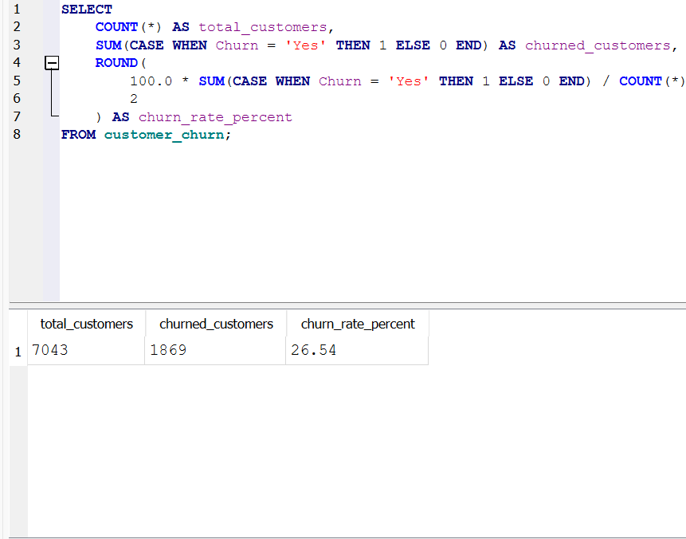
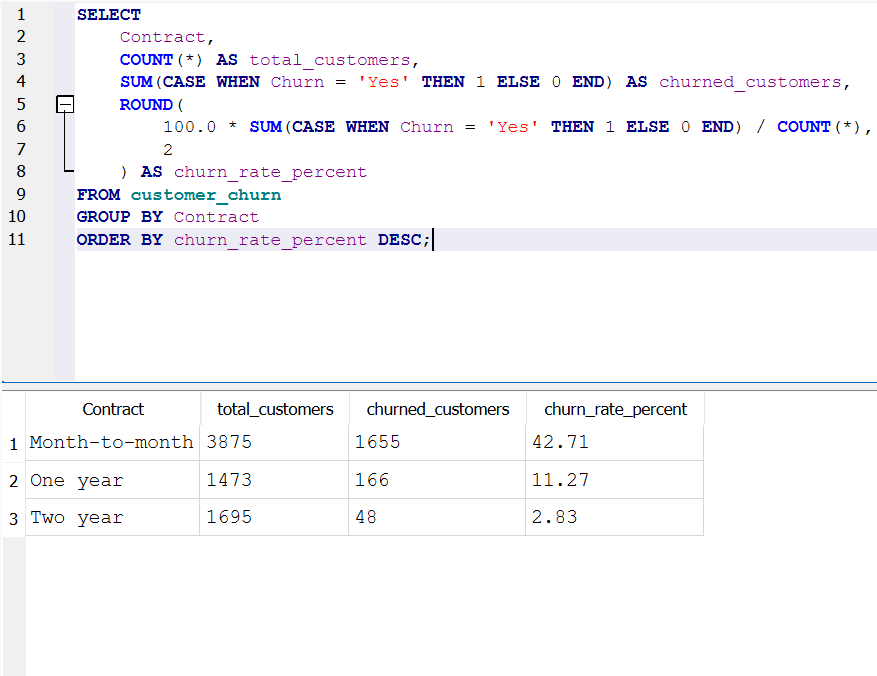
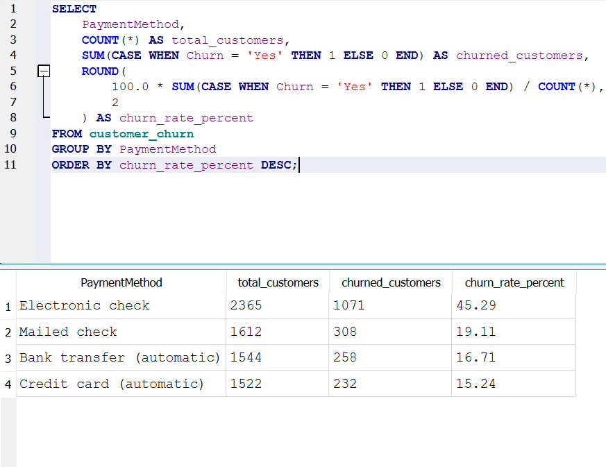
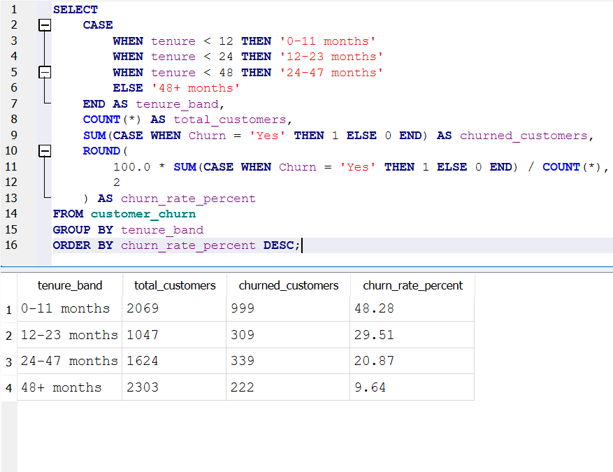
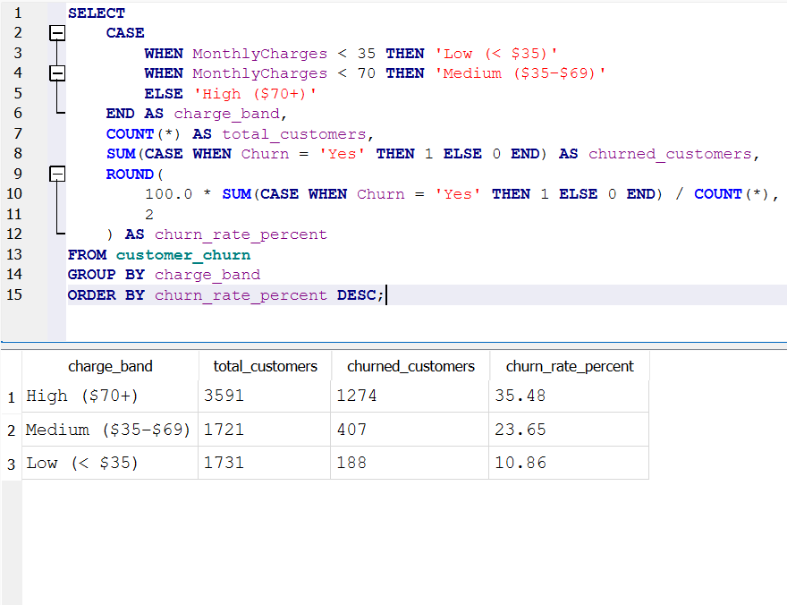
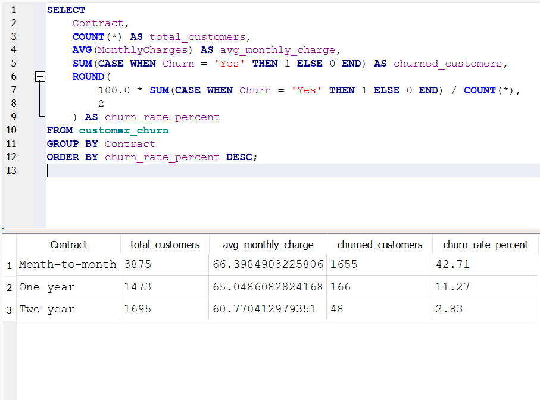

## SQL Customer Churn Analysis

## Project Overview

This project analyzes customer churn patterns using SQL to identify factors associated with customer retention and cancellation behavior. The analysis focuses on contract types, payment methods, customer tenure, and pricing to determine which customer segments are most likely to churn.

The dataset contains over 7,000 telecom customers and includes demographic information, service subscriptions, billing data, and churn status. SQL queries were used to calculate churn rates, segment customers, and uncover key patterns affecting customer retention.

## Dataset

The dataset used in this project is the IBM Telco Customer Churn dataset. It contains customer demographic data, account information, service subscriptions, and churn status.

Key columns include:

- customerID
- tenure
- Contract
- PaymentMethod
- MonthlyCharges
- TotalCharges
- Churn

## Tools Used

- SQL
- SQLite
- DB Browser for SQLite

## Business Questions

The following questions were explored using SQL:

1. What is the overall churn rate?
2. Which contract types have the highest churn?
3. How does churn vary by payment method?
4. Does customer tenure affect churn risk?
5. Do higher monthly charges correlate with higher churn?

## Key Findings

- Month-to-month contracts have significantly higher churn rates compared to one-year and two-year contracts.
- Customers paying with electronic checks churn more frequently than those using automatic payment methods.
- New customers with shorter tenure are far more likely to churn than long-term customers.
- Higher monthly charges are associated with increased churn risk.

## Example SQL Query

Below is an example query used to calculate churn rate by contract type.

SELECT
    Contract,
    COUNT(*) AS total_customers,
    SUM(CASE WHEN Churn = 'Yes' THEN 1 ELSE 0 END) AS churned_customers,
    ROUND(
        100.0 * SUM(CASE WHEN Churn = 'Yes' THEN 1 ELSE 0 END) / COUNT(*),
        2
    ) AS churn_rate_percent
FROM customer_churn
GROUP BY Contract
ORDER BY churn_rate_percent DESC;

# Screenshots Section

## Query Results

### Overall Churn Rate

### Churn by Contract Type

### Churn by Payment Method

### Churn by Tenure

### Churn by Monthly Charges

### Contract Churn AVG Charge

## Skills Demonstrated

- SQL querying
- Data aggregation and segmentation
- Customer churn analysis
- Business insight generation
- Data exploration and interpretation
